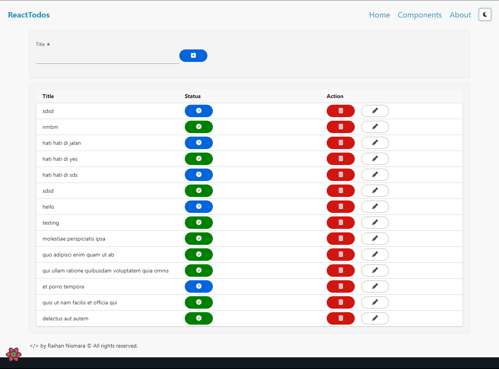
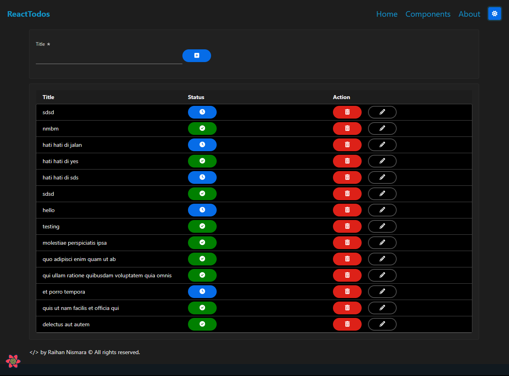

# Todo Web Application




## Welcome to the Todo Web Application! This simple and intuitive todo list helps you stay organized and manage your tasks with ease. You can access the live demo of the application [here](https://react-todos-omega.vercel.app/).

## Features

- Add, edit, and delete tasks.
- Mark tasks as completed.
- Filter tasks by status (All, Active, Completed).
- Clear all completed tasks with one click.
- Responsive design, accessible on various devices.

## Demo

You can try out the live demo of the Todo Web Application by clicking [here](https://react-todos-omega.vercel.app/).

## Installation

To run the application locally, follow these steps:

1. Clone this repository to your local machine:

   ```bash
   git clone https://github.com/raihan71/react-todos.git
   ```

2. Navigate to the project directory:

   ```bash
    cd react-todos
   ```

3. Install the required dependencies:

   ```bash
    npm install
   ```

4. Start the development server:
   ```bash
   npm start
   ```

5. Open your web browser and visit http://localhost:3000 to use the application.

## [Technologies Used](https://github.com/raihan71/react-todos/blob/1a0ef41dd3b8bf90a03256a251194f168df70d51/package.json)

React.js
HTML/CSS
JavaScript
Vercel (for deployment)

## License

This project is licensed under the MIT License - see the [LICENSE](https://opensource.org/license/mit/) file for details.

## Contact

If you have any questions or suggestions, feel free to create an issue

Happy task management! 📝🚀
